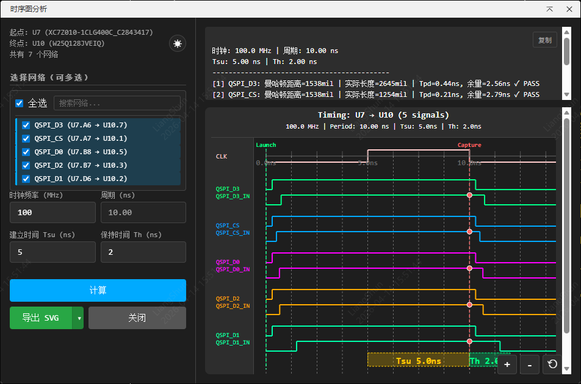
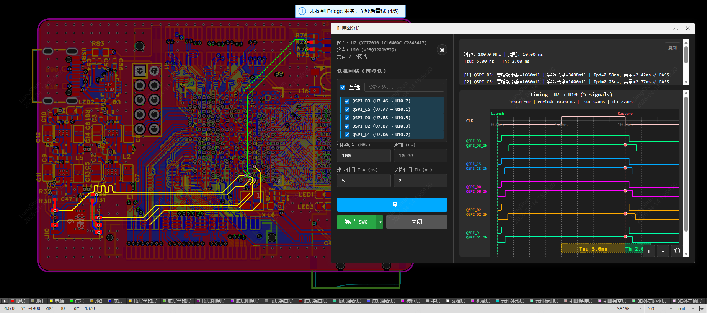
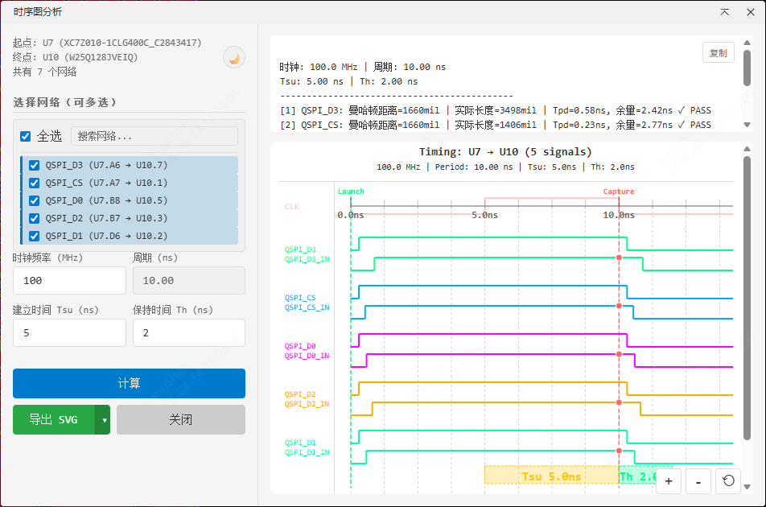

# 时序图分析工具 (Timing Analysis Tool)

嘉立创EDA专业版时序图分析扩展插件

## 功能

### 主界面

### 网络高亮功能

### 主题切换

本插件是一款专业的PCB时序分析工具，用于分析PCB设计中两个器件之间的时序关系。通过选择源器件和目标器件，自动分析两者之间的信号网络，实时计算路径延迟和时序余量，并生成直观的时序图。

### 1. 器件选择分析
- 选择源器件和目标器件
- 自动识别两个器件之间的共同网络
- 显示器件信息和网络列表

### 2. 时序参数设置
- 时钟频率设置 (1-1000 MHz)
- Setup Time (Tsu) 建立时间设置
- Hold Time (Th) 保持时间设置
- 实时计算时序余量 (Margin)

### 3. 时序图可视化
- 生成直观的SVG时序图
- 显示时钟信号、数据输出、数据输入
- 标注Launch/Capture时序点
- 显示Setup/Hold时间窗口
- 显示Tpd传播延迟
- 显示时序通过/失败状态 (PASS/FAIL)

### 4. 网络高亮功能
- 分析时自动高亮选中网络
- 鼠标悬停临时高亮网络
- 退出时自动取消高亮

### 5. 导出功能
- 支持导出SVG/PNG/JPG格式
- PNG/JPG固定3倍分辨率输出

### 6. 界面主题
- 深色主题
- 浅色主题
- 跟随系统主题

### 7. 交互功能
- 鼠标滚轮横向缩放
- 鼠标拖拽移动视图
- Ctrl+滚轮垂直滚动
- 搜索过滤网络

## 使用方法

### 安装扩展
1. 打开嘉立创EDA专业版
2. 进入扩展管理（高级 → 扩展管理）
3. 导入 `.eext` 文件

### 使用步骤
1. 打开PCB文档
2. 点击菜单：**时序分析** → **选择器件分析**
3. 在PCB上选择两个器件（源器件 → 目标器件）
4. 在弹出的参数设置界面中：
   - 设置时钟频率
   - 设置Setup Time和Hold Time
   - 勾选要分析的网络（支持搜索过滤）
5. 点击"计算"查看时序分析结果
6. 查看生成的时序图和时序余量

### 取消选择
如果需要重新选择器件，点击 **时序分析** → **取消选择**

## 时序参数说明

| 参数 | 说明 |
|------|------|
| 时钟频率 | 时钟信号的频率 (MHz) |
| 周期 | 时钟周期 (ns) = 1000/频率 |
| Setup Time (Tsu) | 建立时间，信号在时钟采样沿之前必须保持稳定的时间 |
| Hold Time (Th) | 保持时间，信号在时钟采样沿之后必须保持稳定的时间 |
| Tpd | 信号传播延迟，从源器件到目标器件的延迟时间 |
| 时序余量 | Tpd - Tsu - Th，正值表示通过 |

## 依赖说明

- 嘉立创EDA专业版 v3.0.0+
- 无需其他扩展依赖

## 开源许可

Apache-2.0

## 技术支持

如有问题或建议，请提交 Issue。
